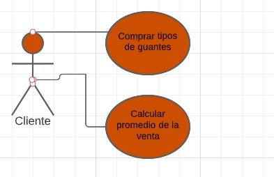
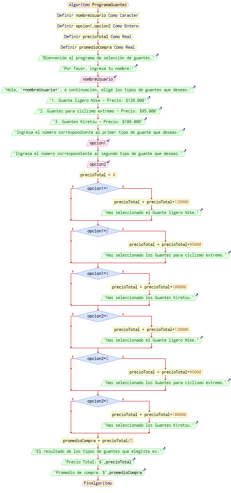

# Ejercicio Base 

De acuerdo con su rango de **programador de software** te han elegido para el desarrollo de una aplicación que necesita un dueño de una tienda de guantes, desea tener una venta basica de sus guantes con tres tipos de guantes distintos para vender.

Se necesita la lista de guantes que estan a la venta y el precio de los guantes.

**Aclaraciones:**

* Se necesitara que se especifique el tipo de guante que se vaya a comprar de los 3 tipos que hay.

* Se Solicita un mensaje basico que diga que tipo de guante fue comprado y el precio del guante.
 
 <br>
 <br>
 <br>
 <br>
 <br>

 **Análisis del Ejercicio:**

### Aproximacion Plantilla de Usuario

<br>
<br>
<br>


# Aproximacion de caso uso


<br>
<br>

### Descripcion

**Nombre**: ComprarTipodeguantes, CalcularPromediodelaventa

**Actores**: Cliente

**Proposito** : Guardar el nombre, los guantes que quiera comprar, el promedio de la venta.

*Curso normal de los eventos*

1. El usuario ingresa al programa.
2. El programa muestra un mensaje de bienvenida y solicita al usuario que ingrese su nombre.
3. El usuario ingresa su nombre.
4. El programa muestra las opciones de guantes disponibles junto con sus precios.
5. El usuario selecciona el número correspondiente al primer tipo de guante que desea.
6. El programa registra la selección del usuario y suma el precio del guante seleccionado al precio total.
7. El usuario selecciona el número correspondiente al segundo tipo de guante que desea.
8. El programa registra la selección del usuario y suma el precio del guante seleccionado al precio total.
9. El programa calcula el promedio de compra dividiendo el precio total entre 2.
10. El programa muestra un mensaje con el resultado de los tipos de guantes seleccionados por el usuario, el precio total y el promedio de compra.
<br>
<br>
<br>

# Aproximacion Diagrama de Flujo



El Diagrama de flujo simula un proceso de selección y compra de guantes, brindando al usuario información sobre los guantes disponibles y calculando el precio total y el promedio de compra.

* El programa solicita al usuario que ingrese su nombre.
* Se muestran tres opciones de tipos de guantes, cada una con su respectivo precio.
* El usuario selecciona dos opciones ingresando los números correspondientes.
* El programa registra las selecciones del usuario y suma los precios de los guantes seleccionados para obtener el precio total de la compra.
* Se calcula el promedio de compra dividiendo el precio total entre 2.
* El programa muestra los resultados al usuario, incluyendo los tipos de guantes seleccionados, el precio total de la compra y el promedio de compra.
<br>
<br>
<br>

# Aproximacion Pseudocodigo

```js
Algoritmo ProgramaGuantes
	Definir nombreUsuario Como Caracter
	Definir opcion1,opcion2 Como Entero
	Definir precioTotal Como Real
	Definir promedioCompra Como Real
	Escribir ' Eres Bienvenido al programa de la tienda de guantes.'
	Escribir 'Ingresa tu nombre:'
	Leer nombreUsuario
	Escribir 'Buenas Tardes, '+nombreUsuario+'Elige los tipos de guantes que deseas:'
	Escribir '1. Guante ligero Nike - Precio: $120.000'
	Escribir '2. Guantes para ciclismo extremo - Precio: $95.000'
	Escribir '3. Guantes Kiretsu - Precio: $100.000'
	Escribir 'Escribe el número correspondiente al primer tipo de guante que deseas:'
	Leer opcion1
	Escribir 'Escribe el número correspondiente al segundo tipo de guante que deseas:'
	Leer opcion2
	precioTotal <- 0
	Si opcion1=1 Entonces
		precioTotal <- precioTotal+120000
		Escribir 'Se agrego el Guante ligero Nike.'
	FinSi
	Si opcion1=2 Entonces
		precioTotal <- precioTotal+95000
		Escribir 'Se agregaron los Guantes para ciclismo extremo.'
	FinSi
	Si opcion1=3 Entonces
		precioTotal <- precioTotal+100000
		Escribir 'Se agregaron los Guantes Kiretsu.'
	FinSi
	Si opcion2=1 Entonces
		precioTotal <- precioTotal+120000
		Escribir 'Se agrego el Guante ligero Nike.'
	FinSi
	Si opcion2=2 Entonces
		precioTotal <- precioTotal+95000
		Escribir 'Se agregaron los Guantes para ciclismo extremo.'
	FinSi
	Si opcion2=3 Entonces
		precioTotal <- precioTotal+100000
		Escribir 'Se agregaron los Guantes Kiretsu.'
	FinSi
	promedioCompra <- precioTotal/2
	Escribir 'El resultado de los tipos de guantes que elegiste es:'
	Escribir 'Total de precio: $',precioTotal
	Escribir 'Promedio : $',promedioCompra
FinAlgoritmo

```

# Programa En Java

```java
import java.util.Scanner;

public class ProgramaGuantes {
    public static void main(String[] args) {
        
        String nombreUsuario;
        int opcion1, opcion2;
        double precioTotal = 0;
        double promedioCompra;

        Scanner scanner = new Scanner(System.in);

        System.out.println("Bienvenido al programa de selección de guantes.");
        System.out.println("Por favor, ingresa tu nombre:");
        nombreUsuario = scanner.nextLine();

        System.out.println("Hola, " + nombreUsuario + ". A continuación, elige los tipos de guantes que deseas:");
        System.out.println("1. Guante ligero Nike - Precio: $120.000");
        System.out.println("2. Guantes para ciclismo extremo - Precio: $95.000");
        System.out.println("3. Guantes Kiretsu - Precio: $100.000");

        System.out.println("Ingresa el número correspondiente al primer tipo de guante que deseas:");
        opcion1 = scanner.nextInt();

        System.out.println("Ingresa el número correspondiente al segundo tipo de guante que deseas:");
        opcion2 = scanner.nextInt();

        if (opcion1 == 1) {
            precioTotal += 120000;
            System.out.println("Has seleccionado el Guante ligero Nike.");
        }

        if (opcion1 == 2) {
            precioTotal += 95000;
            System.out.println("Has seleccionado los Guantes para ciclismo extremo.");
        }

        if (opcion1 == 3) {
            precioTotal += 100000;
            System.out.println("Has seleccionado los Guantes Kiretsu.");
        }

        if (opcion2 == 1) {
            precioTotal += 120000;
            System.out.println("Has seleccionado el Guante ligero Nike.");
        }

        if (opcion2 == 2) {
            precioTotal += 95000;
            System.out.println("Has seleccionado los Guantes para ciclismo extremo.");
        }

        if (opcion2 == 3) {
            precioTotal += 100000;
            System.out.println("Has seleccionado los Guantes Kiretsu.");
        }

        promedioCompra = precioTotal / 2;
     
        System.out.println("El resultado de los tipos de guantes que elegiste es:");
        System.out.println("Precio Total: $" + precioTotal);
        System.out.println("Promedio de compra: $" + promedioCompra);

        scanner.close();
    }
}

```
     
     


